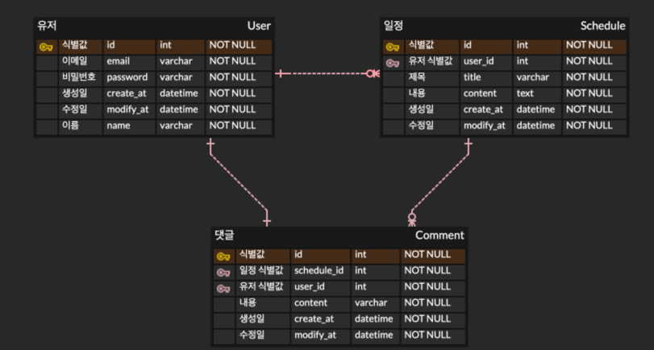

# Scheduler - 기초
 내일배움캠프 Spring 6기 스프링 기초반 과제입니다.
## 개발 전 요구사항
- [x] 응답에 비밀번호는 제외한다.
- [x] 수정 및 삭제 시 비밀번호가 일치한 경우에만 가능하다. 비밀번호가 일치하지 않는 경우 예외를 발생시킨다.
- [x] 3 Layered Architectur에 따라 개발한다.
- [x] JDBCTemplate을 사용하여 개발한다.

## 필수 기능 요구사항
### LV 0. API 명세서 및 ERD 설계
- [x] API 명세서 작성하기
  - https://whip-newt-27d.notion.site/API-1c08763d303280c0bcbcf00ba8717310?pvs=4
- [x] ERD 설계하기
  
- [x] schedule.sql 파일에 쿼리 작성하기
### LV 1. 일정 생성 및 조회
- [x] 일정 생성하기
  - 제목, 내용, 작성자, 비밀번호, 비밀번호 확인, 작성/수정일 입력받기
- [x] 전체 일정 조회
  - 필터링 조건: 등록일, 작성자, 제목
- [x] 선택 일정 조회
  - 일정의 고유 식별자를 사용하여 조회
### LV 2. 일정 수정 및 삭제
- [x] 선택한 일정 수정
  - 제목, 내용, 작성자명 수정 가능
  - 수정 완료 시 수정일 업데이트
- [x] 선택한 일정 삭제

## 도전 기능 요구사항
### LV 3. 연관 관계 설정
- [x] 작성자와 일정의 연결
  - 동명이인의 작성자가 있어 어떤 작성자가 등록한 '할 일'인지 구별할 수가 없음
  - 작성자 테이블과 연관 관계 설정을 통해 작성자와 할 일을 분리하여 관리
  - 할 일 생성 시 이메일을 추가로 입력받음. 해당 이메일로 작성한 할 일이 존재할 시, 비밀번호 또한 일치해야함. 
### LV 4. 페이지네이션
- [x] 데이터를 여러 페이지로 나누어 응답
  - 페이지 번호와 페이지 크기를 쿼리 파라미터로 전달
  - 필요한 데이터만 조회하고 반환
### LV 5. 예외 발생 처리
- [x] HTTP 상태 처리와 에러 메시지를 포함하여 예외를 관리
  - 사용자 정의 예외 클래스 생성
  - @ExceptionHandler를 활용
### LV 6. null 체크 및 특정 패턴에 대한 검증 수행
- [x] @Valid 어노테이션을 활용한 무결성 보장

# Scheduler - 숙련
내일배움캠프 Spring 6기 스프링 숙련반 과제입니다.

## 피드백을 바탕으로 한 수정사항
- [ ] BaseException 를 사용하신 점은 좋았습니다만, ScheduleException 와 UserException 가 상속받아 ExceptionHandler 에서 같이 사용하면 어땟을까란 생각이 드네요.
- [x] GetSchedulesDto 외에는 builder 를 사용하지 않는데 build 어노테이션을 필요 없을 것 같습니다.
- [ ] 개발을 진행하다보면 Dto 가 너무 많아지는 경우가 존재합니다.

## 필수 기능 요구사항
- [x] 기존 코드를 모두 JPA를 활용하도록 수정합니다.
  - [x] JPA Auditing을 활용한 작성일, 수정일 필드
  - [x] Entity와 Spring-Data-Jpa Repository를 도입
- [ ] 이메일과 비밀번호를 활용해 로그인 / 회원가입 기능을 추가합니다.
  - [x] 회원가입 API 
    - [x] 비밀번호 암호화(PasswordEncoder 구현)
  - [ ] 로그인 API 구현
    - [ ] 필터를 활용한 인증 처리
    - [x] Cookie/Session을 활용한 로그인 구현

## 도전 기능 요구사항
- [x] 다양한 예외처리를 적용합니다.
  - [x] 이메일 포맷 검증(정규 표현식)
  - [x] 할 일 제목은 10글자 이내, 유저명은 4글자 이내
- [ ] 댓글 CRUD를 구현합니다.
- [x] 일정 페이징 조회
  - [x] Spring Data JPA에서 제공하는 Pageable과 PageRequest를 활용하여 페이징 구현